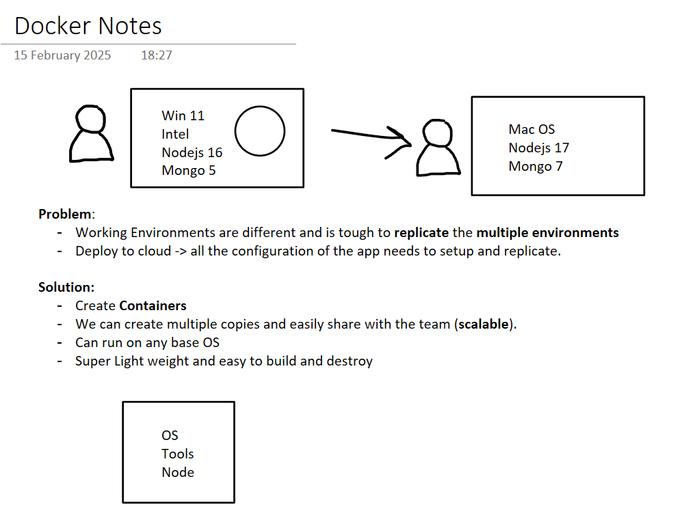

# Docker Basics

## Contents

- [What is Docker?](#what-is-docker)
- [Why Use Docker?](#why-use-docker)
- [Key Benefits](#key-benefits)
- [How it works behind the scene and how is it OS independent?](#how-it-works-behind-the-scene-and-how-is-it-os-independent)
     - [Core Architecture Components](#core-architecture-components)
     - [OS Independence Mechanism](#os-independence-mechanism)
- [Docker vs. Virtual Machines Architecture](#docker-vs-virtual-machines-architecture)
     - [Key Differences](#key-differences)
- [Getting Started](#getting-started)
     - [Images](#images)
     - [Containers](#containers)
     - [Commands](#commands)
     - [Port Mapping](#port-mapping)
     - [Setting Environment Variables](#setting-environment-variables)
     - [DockerFile](#dockerfile)
- [Optimization](#optimization)
     - [Decreasing the Size of the Image](#decreasing-the-size-of-the-image)
     - [Order Matters](#order-matters)
     - [Caching Layers](#caching-layers)
     - [Multi-Stage Builds](#multi-stage-builds)
     - [Docker Login and Push](#docker-login-and-push)
- [Docker Compose](#docker-compose)
     - [Defining Services](#defining-services)
     - [Starting and Stopping Services](#starting-and-stopping-services)

## What is Docker?

Docker is a platform that allows you to develop, ship, and run applications in containers. Containers are lightweight, portable, and consistent across different environments, making them ideal for software deployment.

## Why Use Docker?

- **Eliminates "It works on my machine" issues** – Ensures consistency across environments
- **Lightweight** – Uses fewer system resources compared to virtual machines (VMs)
- **Fast Deployment** – Applications run as isolated processes, reducing boot-up time
- **Scalability** – Easily scale up/down applications with minimal overhead

## Key Benefits

- All configurations are done inside the container and can be easily shared across systems
- Provides a lightweight and standalone executable package that includes everything needed to run software:
     - Application code
     - Runtime environment
     - System libraries
     - Environment variables
     - Configuration files



## How it works behind the scene and how is it OS independent?

Docker achieves OS independence and efficient resource usage through its architecture that combines virtualization concepts, efficient threading, and a central daemon:

### Core Architecture Components

- **Docker Daemon**: A background service running on the host that manages building, running, and distributing Docker containers. It listens for API requests and handles container lifecycle.

- **Containerization vs. Full Virtualization**: Unlike traditional VMs that virtualize an entire OS with their own kernel, Docker containers share the host OS kernel and isolate the application processes from each other.

**Example**:
When you run `docker run nginx`, here's what happens:

1. The Docker client sends this command to the Docker daemon
2. The daemon pulls the nginx image if not locally available
3. The daemon creates a new container by using the host's kernel namespaces, control groups, and UnionFS
4. The daemon assigns resources and executes the container process

### OS Independence Mechanism

Docker achieves cross-platform compatibility through:

- **Abstraction Layer**: The Docker Engine provides a consistent interface regardless of the underlying OS
- **OS-Specific Implementations**:
     - On Linux: Uses native containerization features (namespaces, cgroups)
     - On Windows/macOS: Runs a lightweight Linux VM (using Hyper-V or Hyperkit, WSL) that hosts the Docker daemon

This architecture allows developers to build once and run anywhere without needing
to worry about the host environment differences.

## Docker vs. Virtual Machines Architecture

Docker containers and virtual machines use fundamentally different approaches to virtualization:

```
┌─────────────────────┐  ┌─────────────────────┐
│     Application     │  │     Application     │
├─────────────────────┤  ├─────────────────────┤
│        Libs         │  │        Libs         │
├─────────────────────┤  ├─────────────────────┤
│    Guest OS (VM)    │  │     Docker Engine   │
├─────────────────────┤  ├─────────────────────┤
│     Hypervisor      │  │                     │
├─────────────────────┤  │      Host OS        │
│      Host OS        │  │                     │
├─────────────────────┤  ├─────────────────────┤
│    Infrastructure   │  │    Infrastructure   │
└─────────────────────┘  └─────────────────────┘
    Virtual Machine              Docker
```

### Key Differences

| Feature        | Docker Containers  | Virtual Machines   |
| -------------- | ------------------ | ------------------ |
| Size           | Lightweight (MBs)  | Heavy (GBs)        |
| Startup Time   | Seconds            | Minutes            |
| Isolation      | Process-level      | Hardware-level     |
| Resource Usage | Low overhead       | Higher overhead    |
| OS             | Shares host kernel | Complete OS per VM |
| Portability    | Highly portable    | Less portable      |

This architectural difference is why Docker containers are more lightweight and efficient while still providing the necessary isolation for applications.

## Getting Started

To start using Docker, install Docker Desktop from the [official website](https://www.docker.com/products/docker-desktop).

### Images

Docker images are read-only templates used to create containers. They contain the application code, runtime, libraries, environment variables, and configuration files needed to run the application. Images are built from a set of instructions written in a Dockerfile.

### Containers

Containers are instances of Docker images that run as isolated processes on the host operating system. Each container has its own filesystem, networking, and process space, ensuring that they are independent and do not share resources explicitly.

### Commands

Here are some essential Docker commands to manage containers and images:

- List running containers:

     ```sh
     docker container ls
     ```

- List all containers (including stopped ones):

     ```sh
     docker container ls -a
     ```

- Start a container:

     ```sh
     docker start <container_id> or <container_name>
     ```

- Stop a container:

     ```sh
     docker stop <container_id> or <container_name>
     ```

- Execute a command inside a running container:

     ```sh
     docker exec <container_id> or <container_name> ls
     ```

- Start an interactive shell session inside a running container:

     ```sh
     docker exec -it <container_id> or <container_name> bash
     ```

- List all Docker images:
     ```sh
     docker images
     ```

### Port Mapping

By default, Docker containers do not expose their ports to the host. To make a container's port accessible from the host, you need to map the container port to a host port using the `-p` flag:

- Syntax:

     ```sh
     <host_port>:<container_port>
     ```

- Example:
     ```sh
     docker run -p 8000:8000 <image_name>
     ```

### Setting Environment Variables

You can set environment variables in a container using the `-e` flag:

- Syntax:

     ```sh
     docker run -e <variable_name>=<value> <image_name>
     ```

- Example:
     ```sh
     docker run -e ENV_VAR=production <image_name>
     ```

### DockerFile

A Dockerfile is a text document that contains all the commands a user could call on the command line to assemble an image. Using a Dockerfile, you can automate the building of Docker images.

```Dockerfile
     FROM ubuntu

     RUN apt-get update
     RUN apt-get install -y curl
     RUN curl -sL https://deb.nodesource.com/setup_18.x | bash -
     RUN apt-get upgrade -y

     RUN apt-get install -y nodejs

     # COPY src dest
     COPY package.json package.json
     COPY package-lock.json package-lock.json
     RUN npm install

     # COPY app.js app.js
     COPY . .

     ENTRYPOINT [ "node", "app.js" ]
```

# Optimization

Optimizing Docker images and containers is crucial for improving performance, reducing build times, and minimizing resource usage. Here are some key strategies for optimization:

### Decreasing the Size of the Image

Using smaller base images can significantly reduce the size of your Docker images. For example, using `alpine` as a base image instead of `ubuntu` can save hundreds of megabytes.

```Dockerfile
FROM node:alpine
```

### Order Matters

The order of commands in a Dockerfile affects the build cache. Place commands that change the least frequently at the top of the Dockerfile to maximize cache reuse. This reduces the need to rebuild layers that haven't changed.

```Dockerfile
# Install dependencies first
COPY package.json package-lock.json ./
RUN npm install

# Copy application code
COPY . .
```

### Caching Layers

Docker caches each layer of the image, which can speed up subsequent builds. By structuring your Dockerfile to take advantage of caching, you can avoid unnecessary rebuilds.

### Multi-Stage Builds

Multi-stage builds allow you to use multiple `FROM` statements in your Dockerfile, creating intermediate images that can be discarded after the final image is built. This helps in reducing the final image size by excluding unnecessary build dependencies.

```Dockerfile
# Stage 1: Build
FROM node:alpine AS builder
WORKDIR /app
COPY package.json package-lock.json ./
RUN npm install
COPY . .
RUN npm run build

# Stage 2: Production
FROM node:alpine
WORKDIR /app
COPY --from=builder /app/dist ./dist
COPY --from=builder /app/node_modules ./node_modules
CMD ["node", "dist/app.js"]
```

```Dockerfile
# Use cached layers for dependencies
RUN apt-get update && apt-get install -y \
     curl \
     && rm -rf /var/lib/apt/lists/*
```

### Docker Login and Push

After building and optimizing your Docker image, you can push it to a Docker registry for distribution. Ensure you are logged in to your Docker account before pushing the image.

```sh
docker login
docker push username/my-node-app
```

## Docker Compose

Docker Compose is a tool for defining and running multi-container Docker applications. It allows you to manage multiple services, networks, and volumes using a single YAML file.

### Defining Services

In a `docker-compose.yml` file, you define the services that make up your application. Each service can specify its image, ports, environment variables, and other configurations.

```yaml
version: "3.8"
services:
        supabase:
                image: supabase/postgres
                ports:
                        - "5432:5432"
                environment:
                        POSTGRES_USER: supabase_admin
                        POSTGRES_PASSWORD: supabase_password
                        POSTGRES_DB: supabase_db

        neon:
                image: neonlabs/neon
                ports:
                        - "5433:5433"
                environment:
                        POSTGRES_USER: neon_admin
                        POSTGRES_PASSWORD: neon_password
                        POSTGRES_DB: neon_db
```

### Starting and Stopping Services

Use the following commands to manage your Docker Compose services:

- `docker-compose up` - Start the services defined in the `docker-compose.yml` file. This command builds, (re)creates, starts, and attaches to containers for a service.

- `docker-compose down` - Stop and remove the containers, networks, and volumes created by `docker-compose up`.

```sh
docker-compose up
docker-compose down
```

Docker Compose simplifies the management of multi-container applications, making it easier to develop, test, and deploy complex systems.

## Docker Networking

Docker provides several network drivers to enable communication between containers and the host system. Each driver has its own use case and configuration options.

```bash
docker network ls
```

### Network Drivers

- **Bridge**: Default network driver. Containers can communicate with each other using IP addresses.

     Example:

     ```sh
     docker network create --driver bridge my_bridge_network
     docker run -d --name container1 --network my_bridge_network nginx
     docker run -d --name container2 --network my_bridge_network nginx
     ```

- **Host**: Removes network isolation between the container and the host. No need to apply port mapping.

     Example:

     ```sh
     docker run -d --network host nginx
     ```

- **Overlay**: Connects multiple Docker daemons across multiple hosts.

     Example:

     ```sh
     docker network create --driver overlay my_overlay_network
     docker service create --name my_service --network my_overlay_network nginx
     ```

- **Macvlan**: Assigns a MAC address to a container, making it appear as a physical device on the network.

     Example:

     ```sh
     docker network create -d macvlan --subnet=192.168.1.0/24 --gateway=192.168.1.1 -o parent=eth0 my_macvlan_network
     docker run -d --name container1 --network my_macvlan_network --ip=192.168.1.2 nginx
     ```

- **None**: Disables all networking. No external or internal network connections are available.

     Example:

     ```sh
     docker run -d --network none nginx
     ```

## Create my custom network:

```sh
docker network create --driver bridge my_custom_network
```

```sh
docker run -it --name container1 --network my_custom_network alpine
docker run -it --name container2 --network my_custom_network ubuntu
```

```sh
docker network inspect my_custom_network
```

# Volume:

- Containers do not persist data by default. When a container is removed, all data generated by the container is lost.
- Volumes are used to persist data generated by and used by Docker containers.

```sh
docker volume ls
```

### Volume Types

- **Named Volume**: Created and managed by Docker. Can be shared between containers.

     Example:

     ```sh
     docker run -d --name container1 -v my_named_volume:/data nginx
     docker run -d --name container2 -v my_named_volume:/data alpine
     ```

- **Host Volume**: Maps a directory on the host to a directory in the container.

     Example:

     ```sh
     docker run -d --name container1 -v /path/on/host:/data nginx
     ```

- **Anonymous Volume**: Created and managed by Docker. Cannot be shared between containers.

     Example:

     ```sh
     docker run -d --name container1 -v /data nginx
     ```

- **Bind Mount**: Maps a file or directory on the host to a file or directory in the container. Supports read-write mode.

     ```sh
     docker run -d --name container1 -v /path/on/host:/data nginx
     ```

## Docker Swarm

Docker Swarm is a clustering and orchestration tool for managing multiple Docker hosts. It allows you to create a cluster of Docker hosts and deploy services across the cluster.

```sh
docker swarm init
```

### Swarm Concepts

- **Node**: A Docker host that is part of the Swarm cluster.

- **Service**: Defines how a container should run in the Swarm cluster.

- **Task**: An instance of a service running on a node.

- **Manager Node**: Controls the Swarm cluster and schedules tasks.

- **Worker Node**: Executes tasks assigned by the manager node.

### Swarm Commands

- `docker swarm init` - Initialize a new Swarm cluster.

- `docker swarm join` - Join a Docker host to the Swarm cluster.

- `docker node ls` - List nodes in the Swarm cluster.

- `docker service create` - Create a new service in the Swarm cluster.

- `docker service ls` - List services in the Swarm cluster.

- `docker service scale` - Scale a service to a specific number of replicas.

- `docker service update` - Update the configuration of a service.

- `docker service rm` - Remove a service from the Swarm cluster.

- `docker stack deploy` - Deploy a new stack or update an existing stack.

- `docker stack ls` - List stacks in the Swarm cluster.

- `docker stack rm` - Remove a stack from the Swarm cluster.

### Create a Service

```sh

docker service create --name my_service --replicas 3 nginx
```

### Scale a Service

```sh
docker service scale my_service=5
```

### Update a Service

```sh

docker service update --image nginx:latest my_service
```

### Remove a Service

```sh

docker service rm my_service
```

### Deploy a Stack

```sh
docker stack deploy --compose-file docker-compose.yml my_stack
```

### List Stacks

```sh
docker stack ls
```
